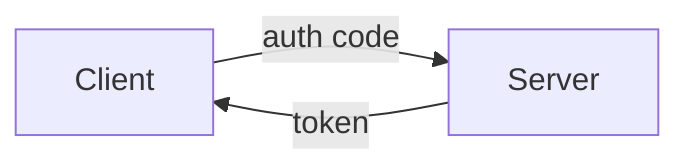
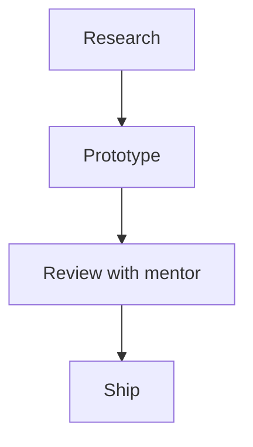

# TaskThink

A hierarchical knowledge base and task manager backed entirely by the filesystem. Pages are Markdown files with YAML frontmatter, organized into an unlimited-depth tree. No database, no index, no cache — files on disk are the truth.

Three interfaces share one core library:
- **Web UI** — WYSIWYG editor, Mermaid diagrams, `[[wikilinks]]`, quick capture
- **CLI** — fast, scriptable, agent-friendly
- **REST API** — full tree traversal for agentic AI workflows

---

## Why filesystem-native?

- Every page is a plain `.md` file — readable, diffable, git-versionable
- Agents (Claude, scripts) can read and write pages directly via the API or filesystem
- No setup friction: `cp -r` to deploy, `rsync` to back up
- Works offline, works over SSH, works forever

---

## Page format

Every page (whether a top-level project or a deeply nested note) is a `.md` file:

```markdown
---
name: Feature Auth Design
state: in-progress
priority: high
due: 2026-04-20
created: 2026-04-10
---

# Feature Auth Design

High-level approach for the OAuth flow.

See [[./api-spec]] for endpoint details.


```

**All metadata fields are optional.** A page can be a pure note with no task metadata.

---

## Filesystem layout

```
TASKS_ROOT/                        ← configurable (default ~/org/taskthink)
├── internship/
│   ├── index.md                   ← folder-page (can have children)
│   ├── feature-auth/
│   │   ├── index.md               ← nested folder-page
│   │   ├── design.md              ← leaf page
│   │   └── api-spec.md
│   └── mentor-notes.md            ← leaf page
├── personal/
│   └── ideas.md
└── .deleted/                      ← soft-deleted pages land here
```

**Folder-pages** (`dir/index.md`) can contain child pages.
**Leaf pages** (`.md` files) hold content but start without children.
Use the **Promote** button (or `POST /api/page/{path}/promote`) to convert a leaf into a folder when you need to add children.

---

## Quick start

### 1. Install

```sh
git clone https://github.com/yourname/taskthink
cd taskthink
bash install.sh
```

The script installs [uv](https://github.com/astral-sh/uv), creates a venv, installs the package, and sets up the CLI symlink.

### 2. Configure

```sh
cp config.sample.toml tasks.toml
$EDITOR tasks.toml   # set root path and server host/port
```

### 3. Run

```sh
./start.sh                          # dev mode with hot-reload
tasks serve                         # production (no reload)
tasks serve --config /path/to.toml  # explicit config file
```

Open `http://localhost:7000` in a browser.

---

## Web UI

```
┌──────────────┬──────────────────────────────────────────────────┐
│ 📋 TaskThink │  [Search…]          [⚡ Capture]  [+ New Page]   │
├──────────────┼──────────────────────────────────────────────────┤
│ TREE NAV     │  internship > feature-auth > design              │
│              ├──────────────────────────────────────────────────┤
│ ▼ internship │  [Title]  state▼  priority▼  due:[   ]          │
│   ▼ feat-auth│  ────────────────────────────────────────────    │
│     design ● │  [WYSIWYG Editor — click anywhere to edit]       │
│     api-spec │  (Mermaid renders inline, [[links]] clickable)   │
│   mentor-note├──────────────────────────────────────────────────┤
│              │  SUB-PAGES: design  api-spec  [+ New sub-page]   │
│ ▼ personal   │  BACKLINKS: ← roadmap  ← internship/index       │
└──────────────┴──────────────────────────────────────────────────┘
```

### Keyboard shortcuts

| Shortcut | Action |
|----------|--------|
| `Ctrl+K` | Quick capture — drop a note or create a page anywhere |
| `Ctrl+/` | Search all pages |
| `Ctrl+S` | Save current page |
| `Esc` | Exit edit mode / close modal |
| Click content | Enter WYSIWYG edit mode |

### Quick capture (Ctrl+K)

The fastest way to capture a mentor tip or fleeting idea:

1. Press `Ctrl+K`
2. Type a title or note
3. Fuzzy-search for the target page
4. Choose **New child page** or **Append note**
5. Press Enter

### Page references (`[[wikilinks]]`)

Link to any page from any other page:

```markdown
See [[internship/feature-auth/design]]    ← root-relative (absolute)
Also see [[./api-spec]]                   ← relative to current page
Or [[../mentor-notes]]                    ← relative parent traversal
```

Links render as clickable anchors in view mode and appear in the **Backlinks** panel of the target page.

### Mermaid diagrams

Use a `mermaid` code fence anywhere in a page:

````markdown

````

Diagrams render inline in view mode.

---

## CLI reference

```sh
tasks add PARENT NAME [--priority high|medium|low] [--due YYYY-MM-DD] [--folder]
tasks list [PARENT]
tasks show PAGE_PATH
tasks state PAGE_PATH STATE
tasks done PAGE_PATH
tasks mv PAGE_PATH NEW_PARENT
tasks note PAGE_PATH "Note text"
tasks search QUERY
tasks edit PAGE_PATH       # opens $EDITOR
tasks rm PAGE_PATH
tasks serve [--config FILE] [--host HOST] [--port PORT] [--reload]
tasks tui
```

**States**: `todo` `in-progress` `blocked` `waiting` `done`
**Priorities**: `high` `medium` `low`
**Page path**: root-relative path, e.g. `internship/feature-auth/design.md`

### Examples

```sh
# Create a root-level folder-page
tasks add . "Internship" --folder

# Create a child page with task metadata
tasks add internship/index.md "Feature Auth" --priority high --due 2026-04-30 --folder

# Add a leaf page under a folder
tasks add internship/feature-auth/index.md "Design Doc"

# Quick note from the terminal (e.g. mentor said something)
tasks note internship/mentor-notes.md "Check the OAuth PKCE flow — mentor suggestion"

# Search across all pages
tasks search "OAuth"

# Mark done
tasks done internship/feature-auth/design.md

# Open in $EDITOR
tasks edit internship/feature-auth/design.md

# Serve with an explicit config file
tasks serve --config ~/my-taskthink.toml
```

---

## REST API

Base URL: `http://localhost:7000`

### Navigation

| Method | Path | Description |
|--------|------|-------------|
| `GET` | `/api/tree` | Full navigation tree |
| `GET` | `/api/children` | Root-level pages |
| `GET` | `/api/children/{parent_path}` | Children of a folder-page |

### Page CRUD

| Method | Path | Description |
|--------|------|-------------|
| `GET` | `/api/page/{path}` | Get page (with children list) |
| `POST` | `/api/pages` | Create page (body: `{name, parent_path, as_folder, state, priority, due, content}`) |
| `PATCH` | `/api/page/{path}` | Update fields (`name`, `content`, `state`, `priority`, `due`) |
| `DELETE` | `/api/page/{path}` | Soft-delete |
| `POST` | `/api/page/{path}/move` | Move to new parent (`{new_parent_path}`) |
| `POST` | `/api/page/{path}/promote` | Convert leaf page to folder-page |

### Agent-friendly endpoints

| Method | Path | Description |
|--------|------|-------------|
| `POST` | `/api/page/{path}/append` | Append timestamped note (`{text}`) |
| `GET` | `/api/search?q=...` | Full-text search across all pages |
| `GET` | `/api/page/{path}/backlinks` | Pages that `[[link]]` to this page |

### Agent usage examples

```sh
# Read the full tree
curl http://localhost:7000/api/tree

# Get a page
curl http://localhost:7000/api/page/internship/feature-auth/index.md

# Create a new page under internship
curl -X POST http://localhost:7000/api/pages \
  -H "Content-Type: application/json" \
  -d '{"name": "Research Notes", "parent_path": "internship/index.md"}'

# Append a note (agent writes plan progress)
curl -X POST http://localhost:7000/api/page/internship/feature-auth/design.md/append \
  -H "Content-Type: application/json" \
  -d '{"text": "Reviewed PKCE flow — approved by mentor"}'

# Search for context
curl "http://localhost:7000/api/search?q=OAuth"

# Get backlinks
curl http://localhost:7000/api/page/internship/feature-auth/design.md/backlinks
```

---

## Configuration

`tasks.toml` (auto-discovered in project root, or set via `--config` / `TASKS_CONFIG`):

```toml
[server]
host = "127.0.0.1"   # "0.0.0.0" to expose on network
port = 7000

[tasks]
root = "~/org/taskthink"
```

**Precedence**: `--config FILE` → `TASKS_CONFIG` env var → `tasks.toml` auto-discovery → `TASKS_ROOT` env var → default

---

## Building a portable bundle

```sh
bash build.sh
# → dist/taskthink-0.1.0.tar.gz
```

Deploy on another machine:

```sh
tar -xzf taskthink-0.1.0.tar.gz
cd taskthink-0.1.0
cp config.sample.toml tasks.toml && $EDITOR tasks.toml
./install.sh
./run.sh
# or: ./run.sh --config /path/to/tasks.toml
```

---

## Project structure

```
taskthink/
├── tasks/
│   ├── config.py      # Config loading, slugify, safe_resolve
│   ├── models.py      # Page, TreeNode (Pydantic)
│   ├── store.py       # All filesystem CRUD — the only layer that touches disk
│   ├── api.py         # FastAPI REST endpoints
│   ├── cli.py         # Typer CLI
│   └── tui.py         # Textual TUI (legacy, unchanged)
├── static/
│   └── index.html     # Single-file SPA (CDN-only, no build step)
├── pyproject.toml
├── tasks.toml         # Runtime config (gitignored)
├── config.sample.toml # Config template
├── install.sh         # Idempotent setup script
├── start.sh           # Dev server with hot-reload
└── build.sh           # Creates portable dist tarball
```

All task I/O goes through `store.py`. Never read/write page files directly in API or CLI layers.

---

## License

MIT
